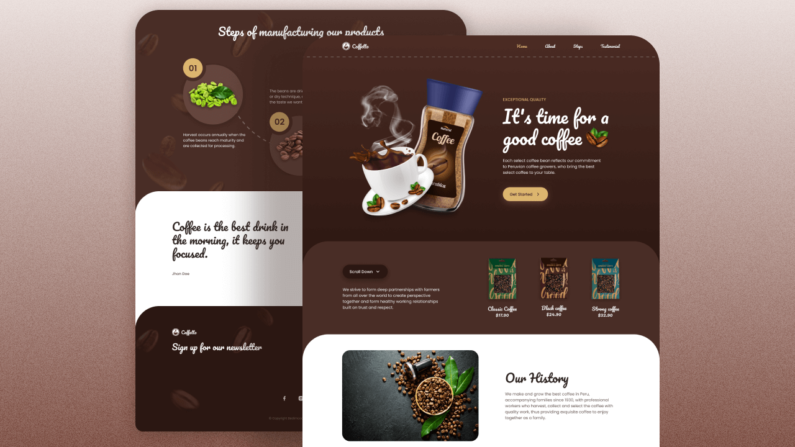

# Responsive-Coffee-website_HTML-CSS-JS

Link to website: <a href="https://halac123b.github.io/Responsive-Coffee-website_HTML-CSS-JS/">Github page</a>

In this project, I've learned:

- Develop a pretty UI from scratch, add to my code library which I can reuse later.  
- Responsive design on devices with different size. 
- Add scroll animation using `scrollrevealjs` library. 

<!--  Thanks to Ytb Bedimcode -->
